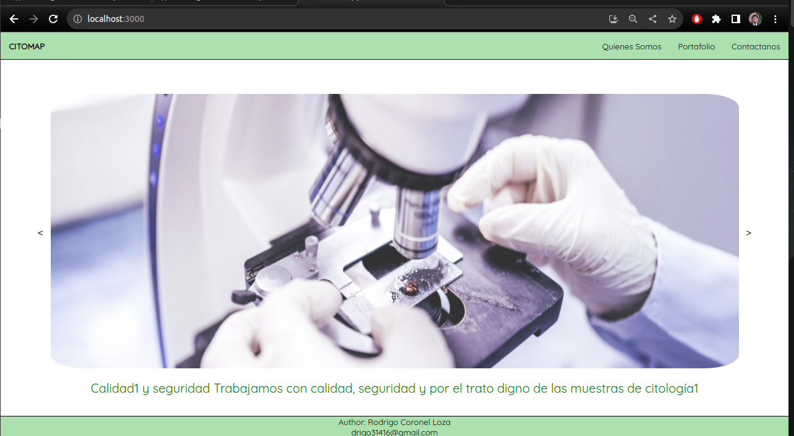
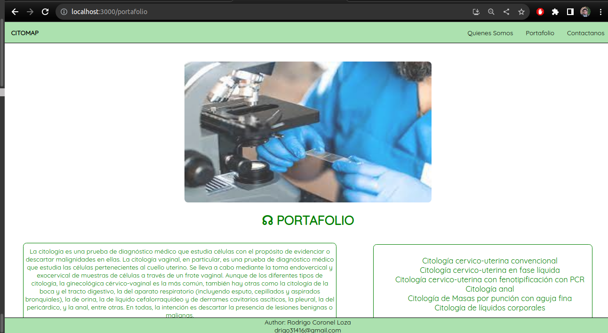
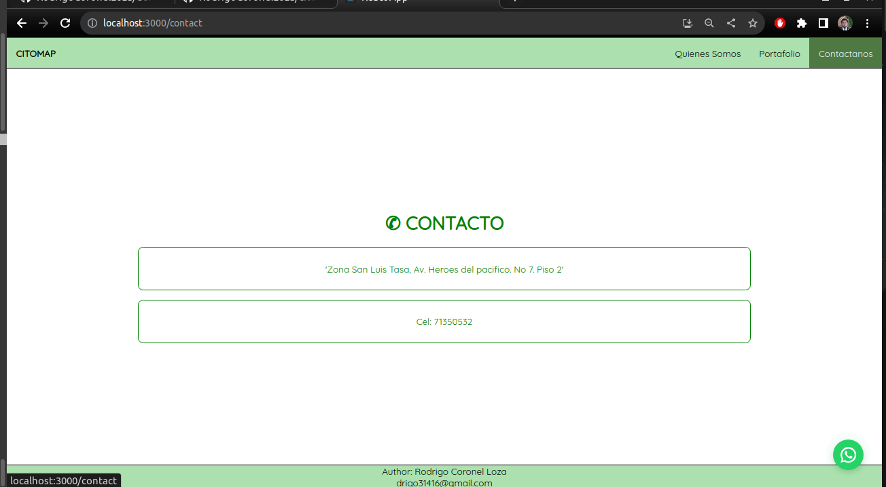

# CITOMAP

CITOMAP is a private site for a medical insitution (called citomap) where doctors can save their patients data and make reports of the diagnosis they make based on the anatomic pathology examination. This part only contains the backend part.

The frontend part was done using React. The doctors can register patients and make their reports using forms in the pageweb and then generating a pdf ready to be sent to other doctors.

## Installation

1. Clone the repo
   ```
   git clone git@github.com:RodrigoCoronelLoza/citomap_react.git
   ```
2. Install NPM packages
   ```
   npm install
   ```
3. Start the project
    ```
   npm start
   ```


In your web browser enter the address : [http://localhost:8000](http://localhost:3000) or [http://127.0.0.1:8000/](http://127.0.0.1:3000/)

## Running

Who we are



Services



Contact 



